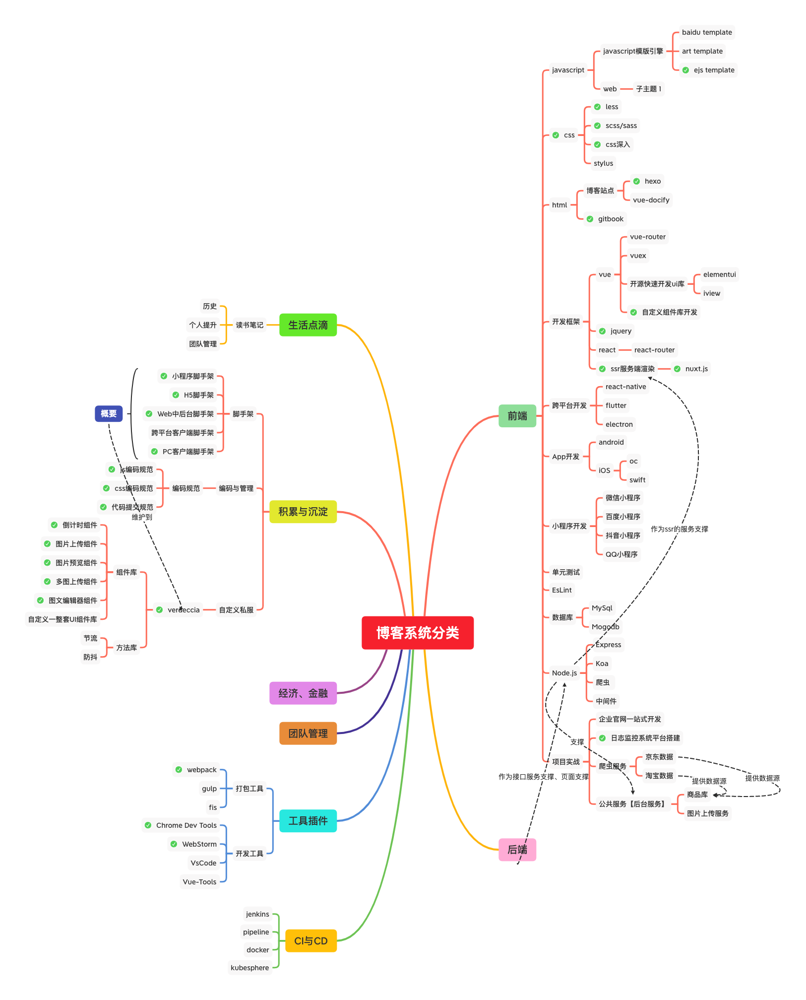

### 关于我
原来从事安卓开发，后转从事 WEB 开发，主要开发语言 `java`, `javascript`，熟悉使用 `vue`、`nuxt`、`react`、`react-native`、`nodejs` 等主流框架语言；

对`服务端`、`前端`、`数据分析`等技能有所了解。

### 关于工作
城市：`广州`
### 关于学习
正在往终身学习者前进...
近期学习方向：大前端全栈
### 博客结构

### 关于座右铭
> 不是井里没有水，而是你挖的不够深

### 关于爱好
热爱`运动`，尤其喜爱`篮球`、`跳绳`、`电影（Top250）`、`阅读`。
### 联系我
* Home: [91temaichang.com](https://91temaichang.com)
* Blog: [91temaichang.com](http://91temaichang.com)
* Email: kbmjj123@gmail.com
* GitHub: [kbmjj123](https://github.com/kbmjj123)

### 博客更新日历

{"monthLang": "cn", "dayLang": "cn", "title": "博客更新日历", "color": { "background": "#f9f9f9", "tooltip": { "background": "#555", "border": "#777" }, "visualMap": { "inRange": ["#ebedf0", "#c6e48b", "#7bc96f", "#239a3b", "#196127"] }, "calendar": { "name": "#3C4858", "itemBorder": "#FFF", "monthLabel": "#3C4858", "dayLabel": "#3C4858" } } }
